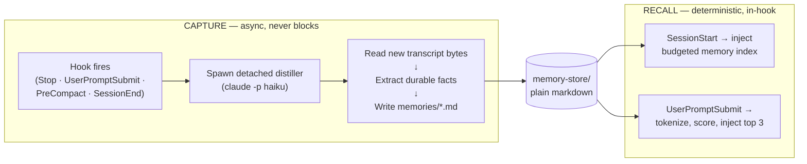
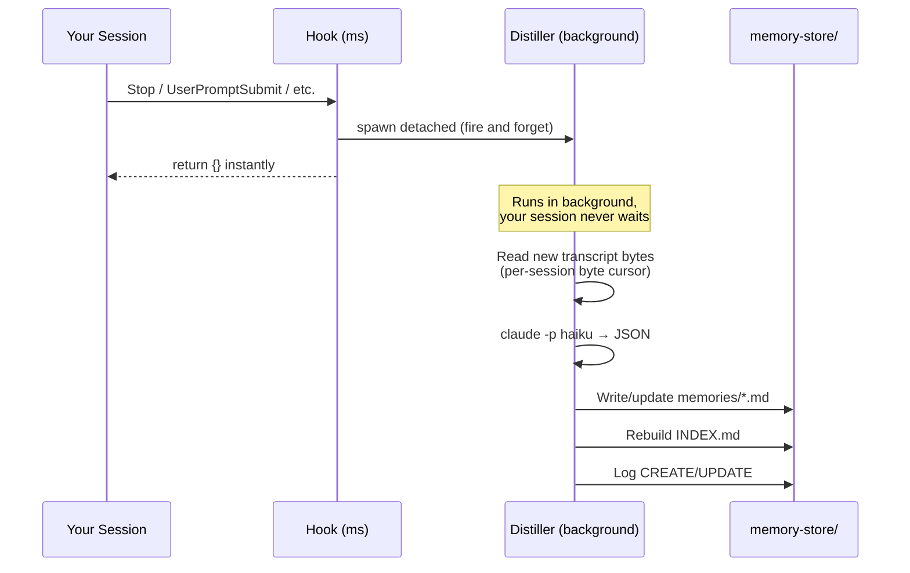
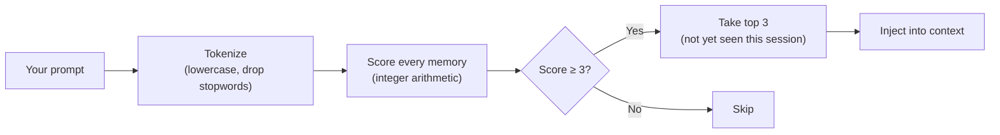

# Engram

**Deterministic memory for Claude Code.**

[](https://github.com/VictorBodnar/engram/actions/workflows/ci.yml)
[](https://www.python.org)
[](./LICENSE)

Long-term memory you can **see**, **search**, and **trust**.
No embeddings. No vector DB. No magic.
Just keyword scoring you can recompute by hand, and a folder of plain markdown you can `grep`.

---

## What it looks like

**A memory** — plain markdown you can read, edit, or `grep`:

```markdown
---
slug: split-shell-commands
type: correction
title: Split shell commands instead of chaining with &&
project: global
keywords: shell, bash, commands, chaining, split
created: 2026-06-14
updated: 2026-06-14
---
Prefer single atomic shell commands over compound commands chained
with && or ;. This lets permission allowlists match individual
commands reliably.
```

**What gets injected** when you type *"how should I run shell commands"*:

```xml
<recalled-memories>
<memory slug="split-shell-commands" type="correction" project="global">
Split shell commands instead of chaining with &&
keywords: shell, bash, commands, chaining, split

Prefer single atomic shell commands over compound commands
chained with && or ;. This lets permission allowlists match
individual commands reliably.
</memory>
</recalled-memories>
```

**What the log records** — every decision, one greppable line:

```
2026-06-19T14:32:01Z RECALL session=s1 project=engram prompt_tokens=4 injected=1 slugs=[split-shell-commands:14] skipped=[]
```

---

## Quick Start

```
/plugin marketplace add https://github.com/VictorBodnar/engram
/plugin install engram
```

Approve the 5 hooks when prompted, then verify:

```
/engram status
```

```
store:    ~/.claude/memory-store
memories: 0
by type:  —
by project: —
state:    0 session file(s) (GC'd after 7d)

recent distiller activity:
  (none logged yet)
```

> **Recommended:** set `"CLAUDE_CODE_DISABLE_AUTO_MEMORY": "1"` in the `env`
> block of `~/.claude/settings.json` so Engram and native auto-memory don't
> double-inject. The installer does this for dev installs automatically.

---

## Architecture



|  | **Capture** (write) | **Recall** (read) |
|---|---|---|
| **When** | Stop, UserPromptSubmit, PreCompact, SessionEnd | SessionStart + every UserPromptSubmit |
| **LLM?** | Yes — **detached** Haiku, off the hot path | **Never** — integer arithmetic only |
| **Speed** | Hooks return `{}` in milliseconds | In-hook, deterministic |
| **What** | Reads new transcript bytes, extracts durable facts | Scores every memory against your prompt |

---

## vs. Native Auto-Memory

|  | **Engram** | **Native auto-memory** |
|---|---|---|
| **Storage** | Plain `.md` files you can read, edit, `grep` | Opaque internal format |
| **Recall** | Deterministic integer scoring — reproducible | Model-driven, non-reproducible |
| **Debugging** | `grep` the log; recompute any score by hand | No visibility into recall decisions |
| **Capture** | Hook → Haiku → markdown with frontmatter | Automatic, invisible |
| **Control** | `/engram search`, `forget`, `clear`, `doctor` | Limited |

---

## How Capture Works



### What gets captured

| Type | When | Example |
|---|---|---|
| **correction** | You state a preference or habit | *"Don't chain shell commands with `&&`."* |
| **knowledge** | A non-obvious codebase/environment fact | *"Integration tests need `LOCALSTACK=1`."* |
| **state** | A project decision or open item | *"Chose SQS over Kafka; migration TODO open."* |

---

## How Recall Works



### Scoring rules

| Signal | Points | Example |
|---|---|---|
| Prompt word in memory **keywords** | **+3** each | `"shell"` matches keyword `shell` |
| Prompt word in memory **title** | **+2** each | `"commands"` in *"Split shell commands…"* |
| Memory belongs to **current project** | **+2** | `memory.project == cwd project` |
| Memory type is **correction** | **+1** | Standing preferences get a boost |

**Gate:** a memory must have at least one keyword or title hit. Project and type bonuses
only *boost* a real hit — they can never qualify a memory alone.

### Worked example

```
Prompt:  "the integration tests pass but nothing seems to run"
Project: payments-api
Tokens:  [integration, tests, pass, run]

  payments-localstack (knowledge · payments-api)
  ├── kw: tests           +3
  ├── kw: integration     +3
  └── project match       +2
                    ─────────
              Score:  8  ✓ INJECT

  use-uv-run-scripts (correction · global)
  ├── title: "run"        +2
  └── type: correction    +1
                    ─────────
              Score:  3  ✓ qualifies

  payments-jwt-rotation (state · payments-api)
  └── (no keyword/title overlap → gated)
                    ─────────
              Score:  0  ✗ skip
```

### Warmup vs. per-prompt recall

```
Session lifecycle:

  SessionStart ─────────────────────────── Prompt 1 ── Prompt 2 ── Prompt 3 ...
       │                                      │            │            │
       ▼                                      ▼            ▼            ▼
   WARMUP                                 RECALL       RECALL       RECALL
   inject budgeted index                  score against prompt text
   (correction > state > knowledge)       gate ≥ 3, top 3, once per session
   (no prompt yet → no scoring)           (dedup: won't re-inject same memory)
```

Warmup loads standing defaults *before* you act.
Recall surfaces topic-specific knowledge *when* you mention it.

---

## The Store

```
~/.claude/memory-store/
├── memories/
│   ├── prefer-aws-cli.md            ← one file per memory
│   ├── split-shell-commands.md
│   └── payments-localstack.md
├── INDEX.md                          ← auto-generated browse mirror
├── state/
│   ├── cursors/{session}.json        ← byte offset already distilled
│   ├── injected/{session}.json       ← slugs already injected this session
│   └── locks/{session}.lock          ← distiller overlap guard
└── logs/
    └── memory.log                    ← structured, greppable audit trail
```

- You can edit memory files by hand — Engram re-reads from disk on every prompt
- `INDEX.md` is a browse mirror only; the runtime never reads it
- State is garbage-collected after 7 days; the log rotates at 2 MB
- Everything in one folder — trivial to inspect, trivial to delete

---

## Commands

| Command | What it does |
|---|---|
| `/engram status` | Memory counts, store path, recent distiller activity |
| `/engram search <terms>` | Rank memories using the **same scorer** recall uses |
| `/engram forget <slug>` | Delete a memory and rebuild the index |
| `/engram clear [--all]` | Wipe all memories. Flags: `--state`, `--logs`, `--all`, `--dry-run` |
| `/engram clear-logs` | Clear only `memory.log`; memories untouched |
| `/engram prune` | Drop empty/untitled orphan memories |
| `/engram reindex` | Rebuild `INDEX.md` from memory files |
| `/engram doctor` | Self-diagnostic: store, cache, hooks, log health |

### Example: `/engram search`

```
$ /engram search shell commands
query tokens: shell, commands
→  14  split-shell-commands (correction·global) — Split shell commands instead of chaining with &&
    3  use-make-targets (knowledge·myproject) — Use make targets for common operations
```

The `→` marks memories that would be injected (score ≥ 3 and within the top 3).

---

## Configuration

| Env var | Default | Effect |
|---|---|---|
| `CLAUDE_MEMORY_HOME` | `~/.claude/memory-store` | Store location. Set per-project to isolate stores. |
| `CLAUDE_CODE_DISABLE_AUTO_MEMORY` | *(unset)* | Set to `1` to disable native auto-memory (recommended). |
| `CLAUDE_MEMORY_FAKE_LLM` | *(unset)* | Path to canned JSON — distiller reads it instead of calling Haiku (for testing). |

---

## Troubleshooting

Start with `/engram doctor` — it checks everything in one shot:

```
Engram doctor
=============

store:
  ok   /Users/you/.claude/memory-store
  ok   store is writable

plugin cache:
  ok   cache matches source

distiller:
  ok   distiller.py exists
  ok   'claude' CLI found on PATH

hooks:
  ok   hooks/hooks.json exists
  ok   5 hook(s) configured across 5 event(s)

log health:
  ok   42 line(s) in memory.log
  ok   no errors in log

locks:
  ok   no locks held

commands:
  ok   /Users/you/.claude/commands/engram.md

12/12 ok, 0 warning(s), 0 error(s)
```

### Common issues

| Symptom | Fix |
|---|---|
| 0 memories after install | Normal — first capture happens after a substantive turn. |
| No memories ever appear | Check `claude` CLI is on PATH and authenticated. `grep ERROR` in the log. |
| Duplicate injections | Native auto-memory is still on. Set `CLAUDE_CODE_DISABLE_AUTO_MEMORY=1`. |
| Stale cache after updating | Run `bash scripts/update.sh` or reinstall. `/engram doctor` will tell you. |

### Log grep cheat sheet

```bash
grep WARMUP ~/.claude/memory-store/logs/memory.log   # session warm-up
grep RECALL ~/.claude/memory-store/logs/memory.log   # per-prompt injection
grep ERROR  ~/.claude/memory-store/logs/memory.log   # failures
grep CREATE ~/.claude/memory-store/logs/memory.log   # new memories captured
```

Every event is keyed by `session=` so concurrent terminals stay legible.

---

## Development

```bash
git clone https://github.com/VictorBodnar/engram.git
cd engram
bash scripts/install.sh      # symlinks cache → source; edits go live instantly
bash tests/smoke.sh          # 36 offline end-to-end tests, no network
bash demo/demo.sh            # narrated walkthrough (also offline)
```

**PR workflow:** every PR runs smoke tests + config validation via GitHub Actions.
On merge to main, the pipeline auto-tags and creates a GitHub release from the
version in `.claude-plugin/plugin.json`. Bump the version in your PR.

---

## Requirements

- **Python 3.9+** (stdlib only — zero third-party packages)
- **`claude` CLI on PATH**, authenticated (reuses Claude Code's own auth — no separate API key)
- **Claude Code** with plugin support

## License

[MIT](./LICENSE) — Victor Bodnar
